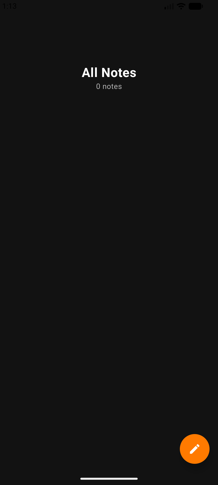
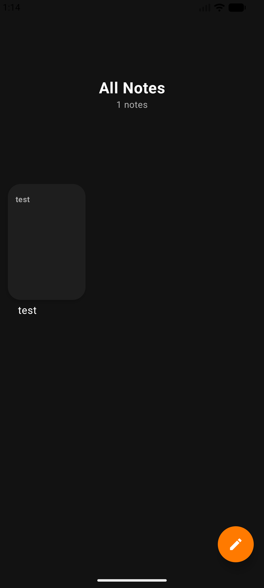
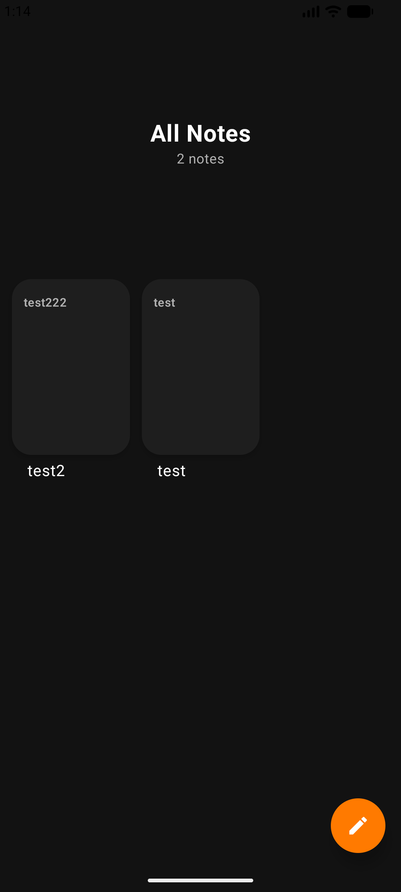
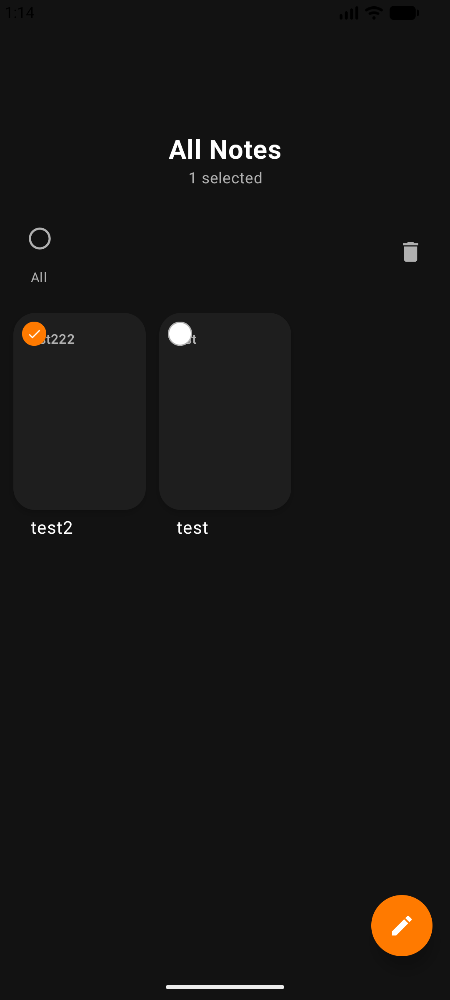
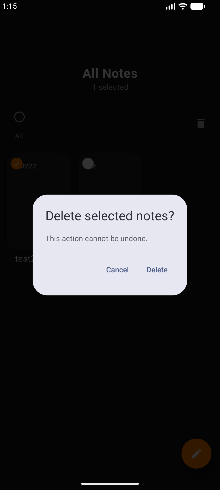
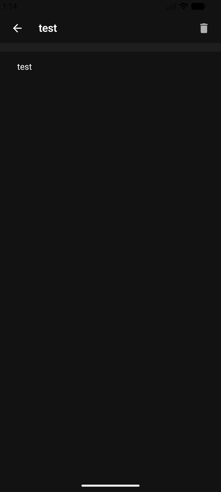

# 📝 Notes App (Jetpack Compose)

A clean, modern, and efficient **note-taking application** built with the latest Android technologies. This app features a sleek **dark-themed UI with orange accents**, designed for a distraction-free writing experience.

---

## ✨ Features

- **✍️ Intuitive Editing:** Seamlessly create and update notes with a real-time saving mechanism.
- **🗑️ Smart Management:** Delete individual notes or use **multi-select** for bulk deletion.
- **✅ Multi-Selection:** Long-press to enter selection mode and manage multiple notes at once.
- **🔍 Organized View:** A beautiful grid/list layout that makes browsing your thoughts effortless.
- **🚀 Local-First:** Powered by **Room Database** for fast, offline-first performance.
- **🎨 Material 3:** Modern UI components and layouts using Jetpack Compose.

---

## 🚀 Tech Stack

- **Language:** [Kotlin](https://kotlinlang.org/)
- **UI Framework:** [Jetpack Compose](https://developer.android.com/jetpack/compose)
- **Database:** [Room Persistence Library](https://developer.android.com/training/data-storage/room)
- **State Management:** [StateFlow](https://developer.android.com/kotlin/flow/stateflow-and-sharedflow) & ViewModel
- **Architecture:** MVVM (Model-View-ViewModel)
- **Navigation:** Navigation Compose
- **Serialization:** KotlinX Serialization

---

## 📸 Screenshots

### 🏠 Notes Dashboard & Selection
Manage your collection of notes with a clean interface and powerful selection tools.

  
  
  

  
  
  

### ✍️ Note Editor
A focused writing environment for creating and editing your thoughts.

  

---

## 📄 License
This project is open-source and available under the [MIT License](LICENSE).
