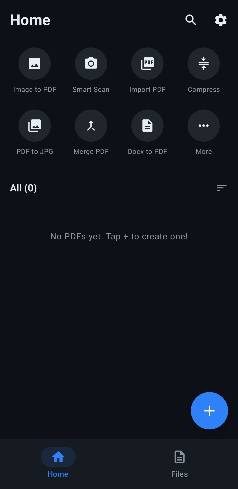
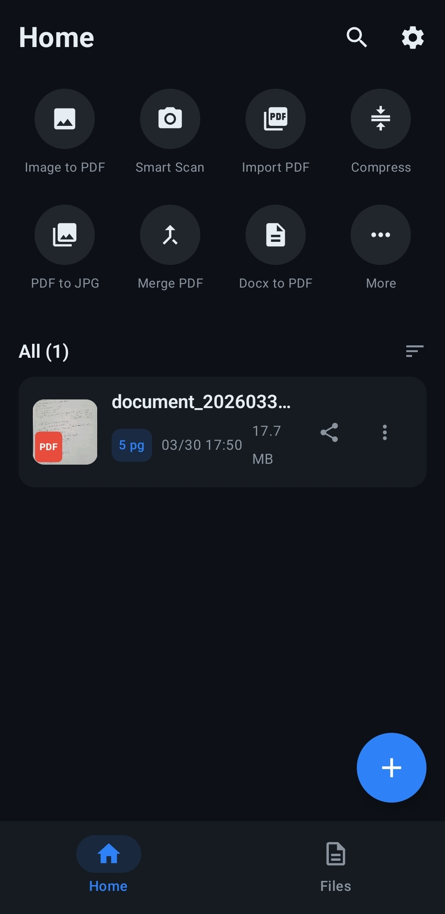
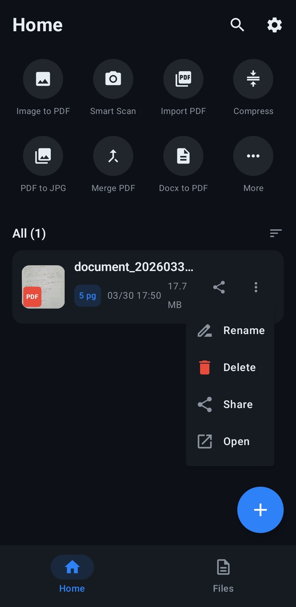
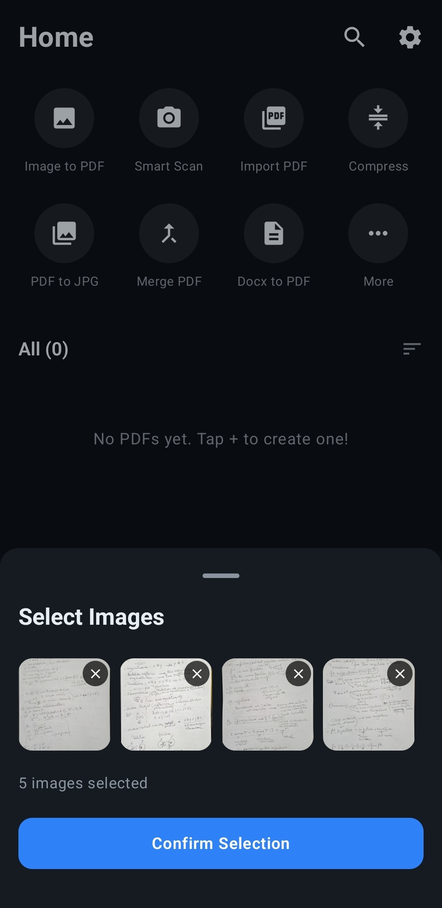
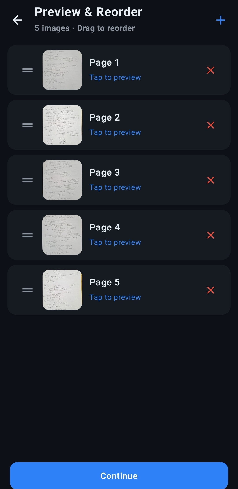
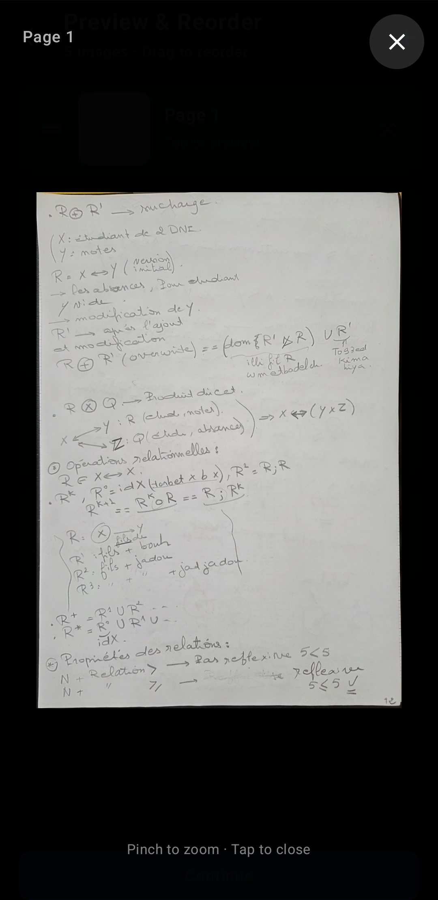
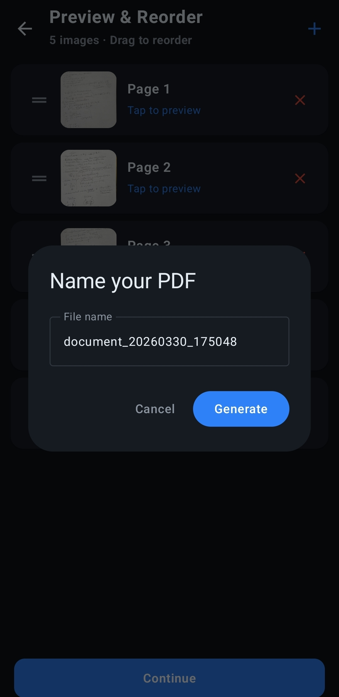
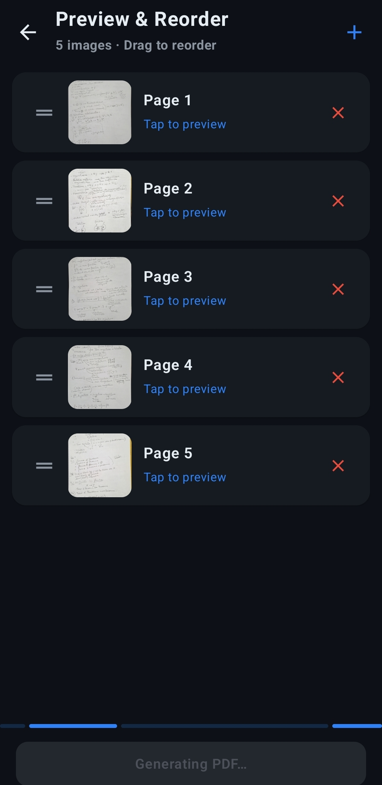
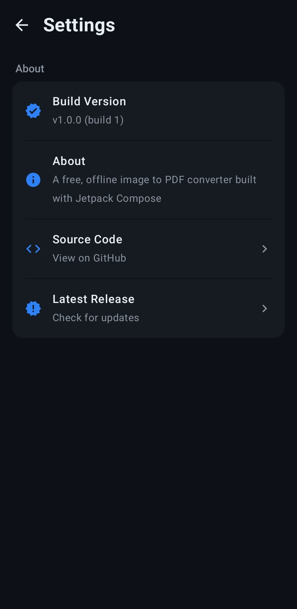

# 📄 Image to PDF Converter (Jetpack Compose)

A sleek, offline **image-to-PDF converter** built entirely with Kotlin and Jetpack Compose. Featuring a polished **dark-themed UI with blue accents**, the app lets you pick images, reorder pages with drag-and-drop, preview them full-screen, and generate perfectly formatted A4 PDFs — all saved straight to your Downloads folder.

---

## ✨ Features

- **🖼️ Image to PDF:** Select multiple images from your gallery and convert them into a single, clean PDF document.
- **🔀 Drag & Drop Reorder:** A dedicated preview screen lets you rearrange pages before generating — drag the handles.
- **🔍 Full-Screen Preview:** Tap any image in the reorder list to view it full-screen with pinch-to-zoom.
- **📝 Custom Naming:** Name your PDF before saving, with smart conflict resolution (overwrite or auto-increment).
- **📂 Recent PDFs:** Browse all your generated PDFs with thumbnail previews, page counts, dates, and file sizes.
- **🔎 Search & Filter:** Instantly find any PDF by name with real-time search.
- **📤 Share & Manage:** Share, rename, delete, or open any PDF directly from the app.
- **⚙️ Settings:** View build info, about page, and links to the source code.
- **🚀 Offline-First:** No internet required — everything runs locally on your device.

---

## 🚀 Tech Stack

- **Language:** [Kotlin](https://kotlinlang.org/)
- **UI Framework:** [Jetpack Compose](https://developer.android.com/jetpack/compose) + [Material 3](https://m3.material.io/)
- **PDF Generation:** [PdfDocument API](https://developer.android.com/reference/android/graphics/pdf/PdfDocument)
- **PDF Thumbnails:** [PdfRenderer](https://developer.android.com/reference/android/graphics/pdf/PdfRenderer)
- **Image Loading:** [Coil](https://coil-kt.github.io/coil/) (`AsyncImage`)
- **Drag & Drop:** [Reorderable](https://github.com/Calvin-LL/Reorderable) (LazyList)
- **State Management:** [StateFlow](https://developer.android.com/kotlin/flow/stateflow-and-sharedflow) & ViewModel
- **Architecture:** MVVM (Model-View-ViewModel)
- **Navigation:** [Navigation Compose](https://developer.android.com/jetpack/compose/navigation)
- **Storage:** [MediaStore](https://developer.android.com/reference/android/provider/MediaStore) (Android 10+) / Downloads directory (older)
- **Min SDK:** 26 · **Target SDK:** 34

---

## 🎨 Design System

| Token              | Value       |
|--------------------|-------------|
| Background         | `#0D1117`   |
| Card / Surface     | `#161B22`   |
| Primary Text       | `#E6EDF3`   |
| Secondary Text     | `#8B949E`   |
| Accent (Blue)      | `#2F81F7`   |
| PDF Badge (Red)    | `#E74C3C`   |
| Corner Radius      | 12 – 16 dp  |

Dark-only theme with clean sans-serif typography.

---

## 🗂️ Project Structure

```
tech.youssefachraf.image_to_pdf/
├── MainActivity.kt
├── navigation/
│   └── AppNavGraph.kt
├── ui/
│   ├── splash/SplashScreen.kt
│   ├── home/
│   │   ├── HomeScreen.kt
│   │   └── components/
│   │       ├── ToolGrid.kt
│   │       └── PdfCard.kt
│   ├── files/FilesScreen.kt
│   ├── search/SearchScreen.kt
│   ├── settings/SettingsScreen.kt
│   ├── picker/
│   │   ├── ImagePickerSheet.kt
│   │   └── PreviewReorderScreen.kt
│   └── theme/
│       ├── Color.kt
│       ├── Theme.kt
│       └── Type.kt
├── viewmodel/
│   ├── HomeViewModel.kt
│   └── PickerViewModel.kt
└── utils/
    └── PdfConverter.kt
```

---

## 📸 Screenshots

### 🏠 Home & File Management
Browse your tools and recently created PDFs, search, share, rename, or delete.

<p align="center">
  
  
  
</p>

### 🖼️ Image Selection, Reorder & Generation
Pick images, preview them full-screen, drag to reorder pages, and generate your PDF.

<p align="center">
  
  
  
</p>
<p align="center">
  
  
</p>

### ⚙️ Settings
View app info and access the source code.

<p align="center">
  
</p>

---

## 🛠️ Build & Run

```bash
# Clone
git clone https://github.com/ACHRAF-YOUSSEF/kotlin-projects.git
cd kotlin-projects/image-to-pdf

# Build debug APK
./gradlew assembleDebug

# Install on connected device
./gradlew installDebug
```

---

## 📄 License

This project is open-source and available under the [MIT License](LICENSE).

